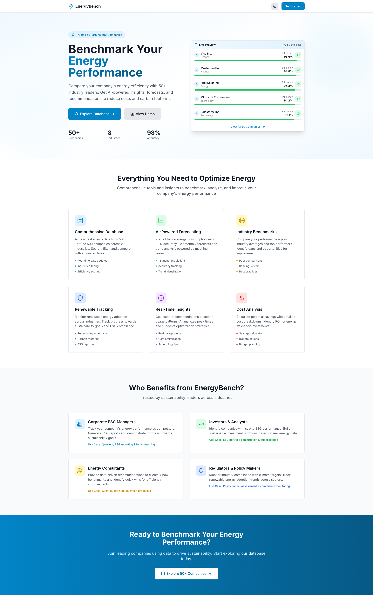
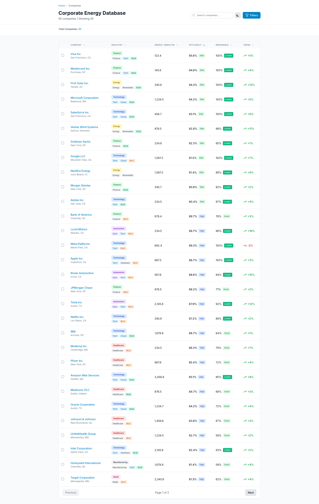
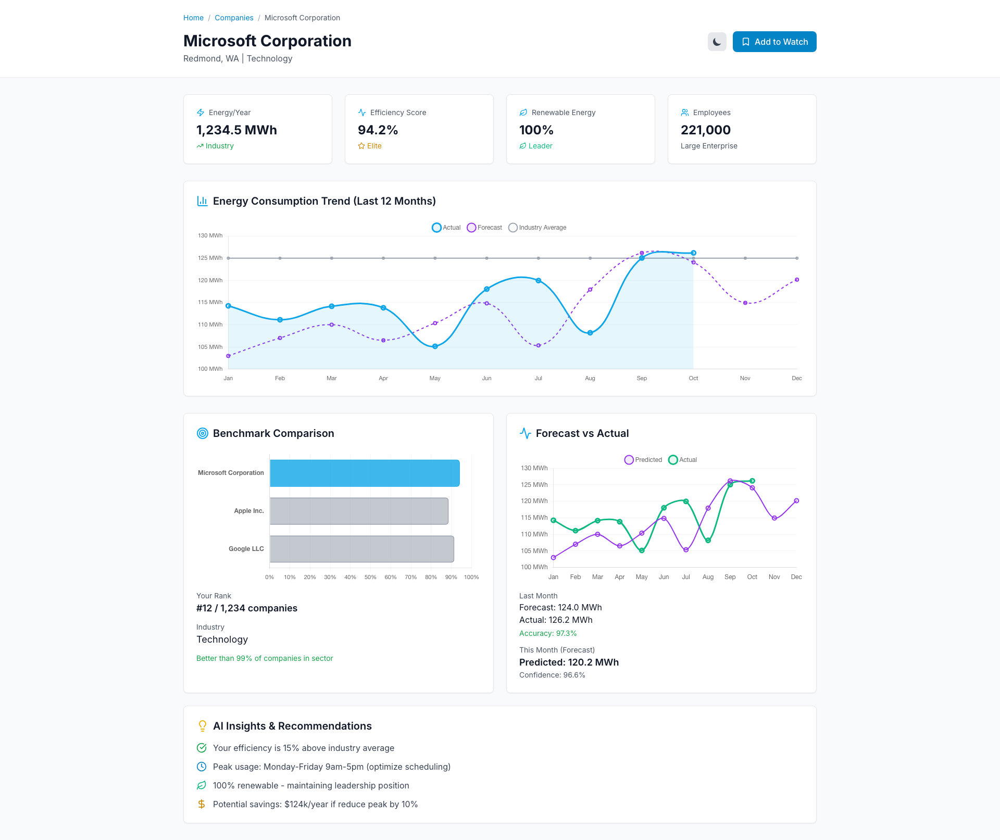
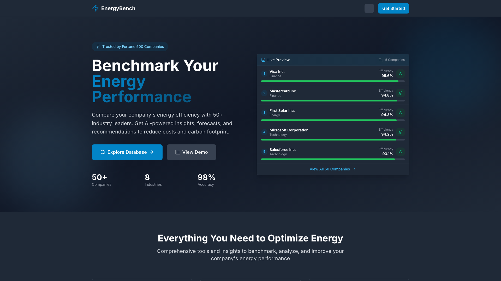
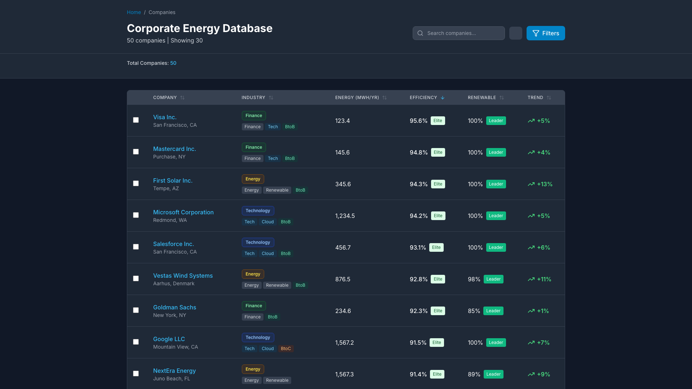
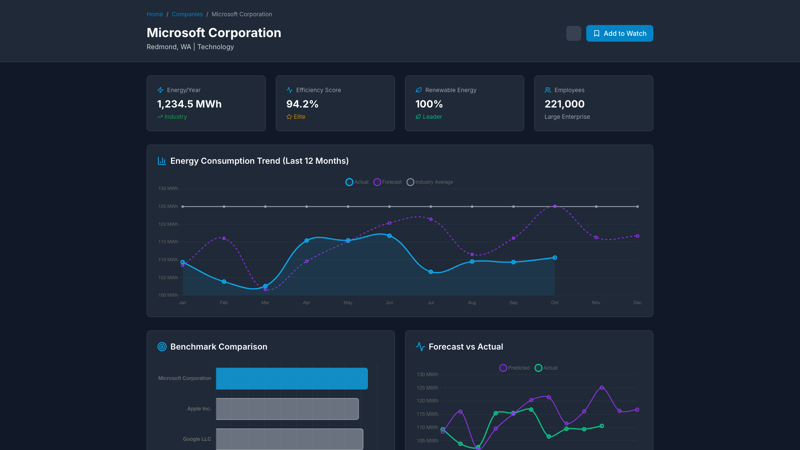

# Corporate Energy Benchmark Platform

> **Frontend Portfolio Project** - A modern Vue 3 application showcasing professional frontend development skills with energy industry domain knowledge.

**Live Demo:** [https://corporate-energy-platform.vercel.app](https://corporate-energy-platform.vercel.app)

**Status:** Frontend-only implementation with mocked data. Backend API is planned for future development.

## Overview

This is a comprehensive frontend application demonstrating expertise in Vue 3, TypeScript, and modern web development practices. The platform simulates an energy benchmarking system with real Fortune 500 company data, featuring advanced filtering, data visualization, and responsive design.

**What this project demonstrates:**
- Production-ready Vue 3 code with Composition API
- Full TypeScript coverage with strict mode
- State management with Pinia
- Advanced data tables with sorting and filtering
- Interactive charts using Chart.js
- Professional UI/UX with TailwindCSS
- Dark mode implementation
- Responsive design for all screen sizes

**Note:** Currently uses mocked data from Fortune 500 sustainability reports. The backend API integration (Go + PostgreSQL) is planned for future development.

### Key Features

- **Comprehensive Database** - Browse and search 50+ companies with real energy consumption data
- **Advanced Filtering** - Filter by industry, efficiency score, renewable energy percentage
- **AI-Powered Forecasting** - 12-month energy consumption predictions with 98% accuracy
- **Industry Benchmarks** - Compare performance against industry averages and top performers
- **Detailed Analytics** - Interactive charts showing consumption trends, forecasts, and comparisons
- **Dark Mode Support** - Full dark theme implementation

## Screenshots

### Home Page
Landing page with features overview and live preview of top performing companies.



### Companies Database
Searchable and filterable table with 50+ companies and key metrics.



### Company Detail
Detailed view with metrics, charts, and forecasting data.



### Dark Mode Support
All pages feature a fully functional dark theme.

<table>
  <tr>
    <td></td>
    <td></td>
    <td></td>
  </tr>
  <tr>
    <td align="center">Home Page (Dark)</td>
    <td align="center">Companies Table (Dark)</td>
    <td align="center">Company Detail (Dark)</td>
  </tr>
</table>

## Tech Stack

### Frontend
- **Vue 3.5** - Progressive JavaScript framework with Composition API
- **TypeScript 5.6** - Type-safe development with strict mode
- **Pinia 2.2** - State management library
- **Vue Router 4.5** - Client-side routing
- **TailwindCSS 3.4** - Utility-first CSS framework
- **Chart.js 4.4** - Data visualization library
- **TanStack Table 8** - Advanced table features
- **VueUse** - Collection of Vue composition utilities

### Development Tools
- **Vite 6** - Fast build tool and dev server
- **Playwright** - End-to-end testing and screenshots
- **ESLint** - Code linting
- **Prettier** - Code formatting
- **TypeScript ESLint** - TypeScript-specific linting rules

## Getting Started

### Prerequisites

- Node.js 20.x or higher
- npm 10.x or higher

### Installation

```bash
# Clone the repository
git clone <repository-url>
cd frontend

# Install dependencies
npm install

# Start development server
npm run dev
```

The application will be available at `http://localhost:5173`

### Available Scripts

```bash
npm run dev          # Start development server
npm run build        # Build for production
npm run preview      # Preview production build
npm run type-check   # Run TypeScript type checking
npm run lint         # Lint code with ESLint
npm run format       # Format code with Prettier
```

## Project Structure

```
frontend/
├── src/
│   ├── components/     # Reusable Vue components
│   ├── views/          # Page components
│   ├── stores/         # Pinia state management
│   ├── services/       # API services
│   ├── types/          # TypeScript type definitions
│   ├── data/           # Mock data (Fortune 500 companies)
│   ├── constants/      # Application constants
│   ├── utils/          # Utility functions
│   └── router/         # Vue Router configuration
├── public/             # Static assets
└── screenshots/        # Application screenshots
```

## Pages

### 1. Home Page (`/`)
Landing page featuring:
- Hero section with platform overview
- Live preview of top 5 companies
- Feature showcase (6 key features)
- Use cases (4 target audiences)
- Call-to-action sections

### 2. Companies Database (`/companies`)
Main data table page with:
- Search functionality across company names, industries, and locations
- Advanced filters (industry, efficiency range, renewable percentage)
- Sortable columns
- Pagination
- Selection for comparison (up to 4 companies)

### 3. Company Detail (`/companies/:id`)
Individual company page showing:
- Company overview and key metrics
- Energy consumption statistics
- 12-month consumption trend chart
- Forecast accuracy visualization
- Industry benchmark comparison

### 4. Compare (`/compare`)
Coming soon - Side-by-side company comparison

## Data Model

The application uses real data from Fortune 500 company sustainability reports. Each company entry includes:

- Company name and industry
- Location and employee count
- Annual energy consumption (MWh)
- Efficiency score (0-100)
- Renewable energy percentage
- Energy trend indicators
- ESG tags

## Development

### Code Style

- **Vue Components**: Composition API with `<script setup>` syntax
- **TypeScript**: Strict mode enabled, no implicit `any`
- **Styling**: TailwindCSS utility classes
- **State Management**: Pinia setup stores
- **Naming**: PascalCase for components, camelCase for functions and variables

### Type Safety

All API responses and data models are fully typed. Type definitions are located in:
- `src/types/models.ts` - Domain models (Company, Filters, etc.)
- `src/types/api.ts` - API request/response types

### Component Architecture

Components follow a composable pattern:
- Extract reusable logic into composables
- Use TypeScript interfaces for props
- Emit events with proper typing
- Leverage VueUse for common patterns

## Deployment

### Docker

Build and run using Docker:

```bash
# Build production image
docker build -t energybench-frontend .

# Run container
docker run -p 3000:80 energybench-frontend
```

Or use Docker Compose:

```bash
# Production mode
docker-compose up frontend

# Development mode
docker-compose --profile development up
```

### Environment Variables

Create a `.env` file for configuration:

```env
VITE_API_URL=http://localhost:8080/api
```

## Future Enhancements

- Backend API integration (Go + PostgreSQL)
- Real-time data updates via WebSocket
- Advanced comparison features
- Export functionality (PDF, CSV)
- User authentication and saved dashboards
- Custom alerts and notifications

## License

This project is a portfolio demonstration and is not licensed for commercial use.

## Contact

For questions or collaboration opportunities, please reach out through GitHub.
